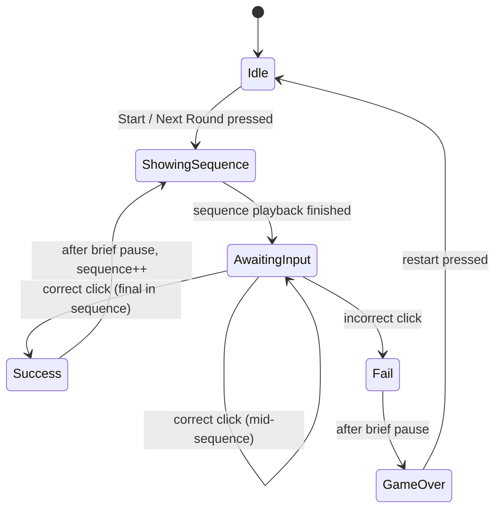

```mermaid
stateDiagram-v2
    [*] --> Idle
    Idle --> ShowingSequence: Start / Next Round pressed

    ShowingSequence --> AwaitingInput: sequence playback finished

    AwaitingInput --> AwaitingInput: correct click (mid-sequence)
    AwaitingInput --> Success: correct click (final in sequence)
    AwaitingInput --> Fail: incorrect click

    Success --> ShowingSequence: after brief pause, sequence++
    Fail --> GameOver: after brief pause

    GameOver --> Idle: restart pressed
```
