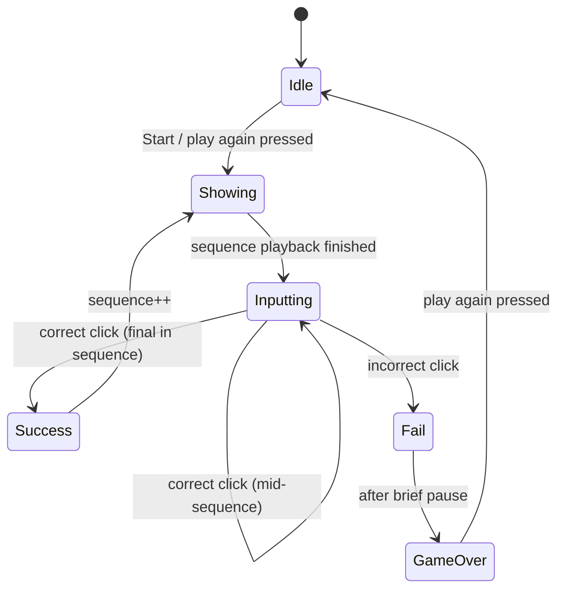

```mermaid
stateDiagram-v2
    [*] --> Idle
    Idle --> Showing: Start / play again pressed

    Showing --> Inputting: sequence playback finished

    Inputting --> Inputting: correct click (mid-sequence)
    Inputting --> Success: correct click (final in sequence)
    Inputting --> Fail: incorrect click

    Success --> Showing: sequence++
    Fail --> GameOver: after brief pause

    GameOver --> Idle: play again pressed
```
