#  React Memory Game

## Table of Contents

- [Story](#story)
- [Game Finite State Machine](#finite-state-machine)
- [Project Structure](#project-structure)

## Story

After I finished React JS basics from [CS571](https://github.com/HsHs-dev/UW-Madison-CS571) course, I thought about building a capstone project, applying the new set of skills I learned, but I didn't want to go down the traditional route and build a TO-DO List app, so I built a GAME!

The game idea is simple yet elegant, it was inspired by Human Bench Mark website [**Sequence Memory**](https://humanbenchmark.com/tests/sequence) test, yet with a WAY better design and more features.

## Finite State Machine



## Project Structure

```
.
├── design
│   ├── about-figma-reference.svg
│   ├── design-page.html
│   ├── keypad-design-spec.md
│   ├── keypad-figma-reference.svg
│   └── leaderboard-figma-reference.svg
├── eslint.config.js
├── favicon.svg
├── fsm.svg
├── index.html
├── package.json
├── package-lock.json
├── public
│   ├── icons.svg
│   ├── og-image.png
│   ├── robots.txt
│   └── sitemap.xml
├── README.md
├── review-style.md
├── src
│   ├── App.jsx
│   ├── assets
│   ├── components
│   │   ├── Board.jsx
│   │   ├── FeedbackFlash.jsx
│   │   ├── icons
│   │   │   └── SocialIcons.jsx
│   │   ├── play
│   │   │   ├── ActionArea.jsx
│   │   │   ├── GameOverCard.jsx
│   │   │   ├── GameOverOverly.jsx
│   │   │   ├── NamePrompt.jsx
│   │   │   └── StatusArea.jsx
│   │   └── ui
│   │       ├── Background.jsx
│   │       ├── LeaderBoardRow.jsx
│   │       ├── NavMenu.jsx
│   │       └── Tile.jsx
│   ├── hooks
│   │   └── useMemoryGame.js
│   ├── layouts
│   │   └── RootLayout.jsx
│   ├── lib
│   │   ├── audio.js
│   │   ├── constants.js
│   │   └── scores.js
│   ├── main.jsx
│   ├── routes
│   │   ├── Leaderboard.jsx
│   │   └── Play.jsx
│   └── styles
│       ├── keycaps.css
│       └── main.css
└── vite.config.js

```
